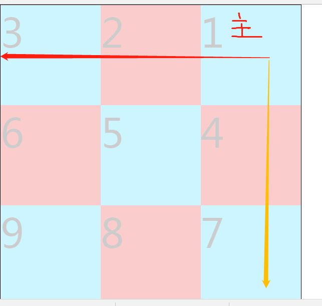

# Preliminary·笔者说

嗨咯，其实每一个部分我会先给出思维导图，这就是笔者的一个思路，对于这一部分的体系结构做出的规划。笔者还是一个菜鸟小白，但是在诸多年的学习中，已经深刻发现架建知识体系结构是多么的重要，不管什么学科，不管什么阶段的学习，搭建知识体系都是很重要。

 我们开发软件，也会有软件的生命周期，这就是一个开发软件的必经之路，软件生命周期内有问题定义、可行性分析、总体描述、系统设计、编码、调试和测试、验收与运行、维护升级到废弃等阶段。这就是一个process，我们在其之中就可以更加明确高效的进行软件管理。那么，学习也是一样的，应该有一个学习路线。现在我引用下atguigu.com的前端路线。

​ 这就是一个比较完整的前端的路线图，但是我想表达的并不是他的知识体系的完整。我更想通过这张图给大家分享我的看法，这里分了七个板块，每个板块在细分进去，它们上下之间是有联系在里面，说浅显点就是前面的是基础知识，后面的是高级知识，它们在知识点上是串联的，你需要的就是把这些知识串起来。开始形成自己的知识体系。把前端路线比作一栋高楼大厦，那么它一开始肯定是先把整个框架架建出来之后，再去加砖添瓦，再去粉刷精修。比如图中七个部分，每一部分就像高楼的每一层，每一层里面会有很多房间，它们既是独立的，也是有联系的。而你要做的是先学懂每个知识点，关键要知道你的知识点是属于哪个大楼？哪一层？哪一个房间？好的，确定下来之后，就把你学的这块知识丢进去。丢进去之后，房间也会很杂乱，所以你还是得整理，把衣服放在一堆，生活用品放在一起等等。这样子，你在学习中，就不会觉得很乱，或者学了一段时间后并不能自己独立去思考学了什么。因为你没有在平常学习中去培养这种高楼大厦的知识体系，那么你又怎么可能做到去对知识的熟能生巧和相互联系呢？

​ 就比如笔者在这一部分就会给出js高级的部分知识，那么你就要把这部分知识放在“前端知识”的高楼大厦中的第5层------JS高级知识。第5层有很多房间，比如有数据类型的相关知识，那么就把有关数据类型的相关知识放在一个房间里，当然这个房间也需要整理：数据类型的分类有哪些？有哪些手段可以对数据类型进行判断？然后又在数据类型分类的基础上，继而去划分出基本类型和对象类型，又在基本类型中划分number、string、Boolean、undefined、null 类型。就是需要这种“一层一层拨开你的心”的感觉。

​ 说了这么多，其实并不是废话。以后每一部分都会给出思维导图，那么你需要看之前整体把握思维导图，看完之后反复思考思维导图，在思维导图上细细思考内部的知识逻辑和联系。**必须要有构建个人知识体系的意识。**当然，笔者也做得很不好。暂时这种水平完全驾驭不了，但一点点来，总可以做好。

​ 另外笔者有一些学习中的见解：

P1: 平常我们出现问题时，会去在网路上看一些博客，以帮助自己的理解。但是别忘记了还有两种手段，那就是我们人类最原始的学习方式，纸质书，像一些计算机的经典的书籍可以拿来看一看，有时候真的会很有帮助，网路上的碎片化的知识居多，但书籍整合的资料会更加完备。第二种手段就是原文标准.比如ECMA官方文件（ES6）：[http://www.ecma-international.org/ecma-262/6.0/index.html](http://www.ecma-international.org/ecma-262/6.0/index.html) 我有时候会去看一下，就会发现，里面的规范规则实则就是很好的总结归纳，真得很详细。所以看一些原文标准文件是真的很不错。

P2:整合前端全部知识的文档：[http://devdocs.io/](http://devdocs.io/)

